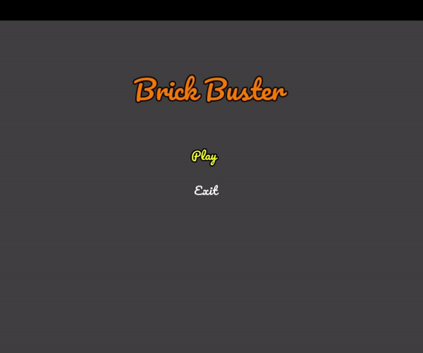

<div align="center" id="top"> 
  

  &#xa0;

  <!-- <a href="https://brickbuster.netlify.app">Demo</a> -->
</div>

<h1 align="center">Brick Buster</h1>

<p align="center">
  

  

  

  

  

  

  
</p>

<!-- Status -->

<h4 align="center"> 
	🚧  BrickBuster 🚀 Under construction...  🚧
</h4> 

<hr>

<p align="center">
  <a href="#dart-about">About</a> &#xa0; | &#xa0; 
  <a href="#rocket-technologies">Dependencies</a> &#xa0; | &#xa0;
  <a href="#white_check_mark-requirements">Requirements</a> &#xa0; | &#xa0;
  <a href="#checkered_flag-starting">Starting</a> &#xa0; | &#xa0;
  <a href="#memo-license">License</a> &#xa0; | &#xa0;
  <a href="https://github.com/ufrshubham" target="_blank">Author</a>
</p>

<br>

## :dart: About ##

I always wanted to lean and understand how to use Box2D for game physics and [CWF: Fall 2020](https://codewithfriends.io/) seemed like the perfect opportunity to start a casual game project to get some hands-on with Box2D. So I started working on this simple break out game called brick buster.

Check [releases](https://github.com/ufrshubham/Brick-Buster/releases) section to get playable executable (currently only avaliable for Windows and Linux). 

## :rocket: Dependencies ##

The following tools were used in this project:

- [SFML](https://www.sfml-dev.org/)
- [Box2D](https://box2d.org/)

## :white_check_mark: Requirements ##

Before starting :checkered_flag:, you need to have 
- Git
- C++ compiler
- Cmake
- If platform is Linux, get following libraries
  - libfreetype6-dev
  - libxrandr-dev
  - libxcursor-dev
  - libx11-dev
  - libflac-dev
  - libvorbis-dev
  - libopenal-dev
  - libudev-dev


## :checkered_flag: Starting ##

```bash
# Clone this project
$ git clone --recursive https://github.com/ufrshubham/Brick-Buster.git

# If the repository was already cloned without submodules, use
$ git submodule update --init

# Enter project directory
$ cd Brick-Buster

# Generate projects files
$ mkdir build
$ cd build
$ cmake ..
```

## :memo: License ##

This project is under license from MIT. For more details, see the [LICENSE](LICENSE) file.


<a href="#top">Back to top</a>
